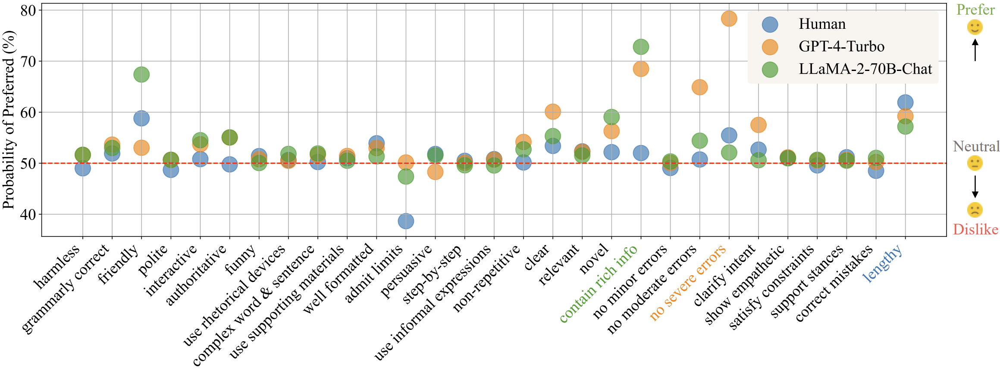

# Preference Dissection

This is the official repository for [Dissecting Human and LLM Preferencces](https://huggingface.co/papers/2402.xxxxx)

[**Interactive Demo**](https://huggingface.co/spaces/GAIR/Preference-Dissection-Visualization) |
[**Dataset**](https://huggingface.co/datasets/GAIR/preference-dissection) | 
[**Paper**](https://arxiv.org/abs/2402.11296) | 
[**Resources**](https://github.com/GAIR-NLP/Preference-Dissection?tab=readme-ov-file#resources) |
[**Citation**](https://github.com/GAIR-NLP/Preference-Dissection?tab=readme-ov-file#citation) 

[//]: # ([**Limitations**]&#40;https://github.com/GAIR-NLP/Preference-Dissection?tab=readme-ov-file#limitations&#41; |)
[//]: # (|[**Featured By AK**]&#40;https://twitter.com/_akhaliq/status/1740571256234057798&#41; )



## News

[//]: # (- [2024/01/06] We released the commercial-use version of MathPile, namely [MathPile_Commercial]&#40;https://huggingface.co/datasets/GAIR/MathPile_Commercial&#41;.)
[//]: # (- [2024/01/06] We released a new version &#40;`v0.2`, a cleaner version&#41; of MathPile. See our [HF dataset homepage]&#40;https://huggingface.co/datasets/GAIR/MathPile&#41; for more details.)
[//]: # (- [2023/12/30] MathPile was featured on the Hugging Face Datasets trending list. [[snapshot]]&#40;./static/images/hf-dataset-trending.png&#41;)
[//]: # (- [2023/12/29] We released the [MathPile]&#40;https://huggingface.co/datasets/GAIR/MathPile&#41;, a 9.5B high-quality and diverse math-centric pre-training corpus.)
- [2024/02/20] We released the paper, code, dataset and an interactive demo for this project.


## Introduction

In this project, we conduct a thorough analysis of human and LLM preferences. Our analysis is based on user-model conversations collected from various real-world scenarios, and we dissect both human preferences and LLM preferences from 32 different models. 

**Here are some key findings:**

- Humans are less sensitive to errors, clearly dislike a model when it admits its limits, and prefer a response that supports their stances.
- Advanced LLMs like GPT-4-Turbo prefer correctness, clarity, and harmlessness more.
- LLMs of similar sizes exhibit similar preferences irrespective of training methods, and the preference of a pretrained-only LLM is largely unchanged after alignment.
- Benchmarks with LLM-as-a-judge are easy to manipulate. Experiments on AlpacaEval 2.0 and MT-Bench show that aligning models with the judges' preferences increases scores, whereas diverge from these preferences leads to lower scores.


## Resources

We release a bunch of resources for this project:

### Interactive Demo
We provide an [interactive demo](https://huggingface.co/spaces/GAIR/Preference-Dissection-Visualization) in Huggingface Spaces. You can play with the demo to see 
- **Complete Preference Dissection in Paper**: shows how the difference of properties in a pair of responses can influence different LLMs'(human included) preference.
- **Preference Similarity Matrix**: shows the preference similarity among different judges.
- **Sample-level SHAP Analysis**: applies shapley value to show how the difference of properties in a pair of responses affect the final preference.
- **Add a New Model for Preference Dissection**: update the preference labels from a new LLM and visualize the results

You can also find the codes of all the analysis in `app.py` in the `Files` tab ([link](https://huggingface.co/spaces/GAIR/Preference-Dissection-Visualization/tree/main)) of the demo.


### The Annotated Dataset
We provide [the annotated dataset](https://huggingface.co/datasets/GAIR/preference-dissection) used in this project. The dataset is based on [lmsys/chatbot_arena_conversations](https://huggingface.co/datasets/lmsys/chatbot_arena_conversations), and contains how each response satisfies the 29 pre-defined properties. Please see more details in the dataset page.

Following the original dataset, the annotated dataset is licensed under CC-BY-NC-4.0.

### Prompts for Annotation
We provide the prompts used in the annotation process in `prompts/`, including the pairwise annotation prompts, as well as the unused single response annotation prompts.

---

In the following, we provide an example guide for the annotation process.

**Step 0: Configure your Environment**
```angular2html
pip install -r requirements.txt
```

**Step 1: Prepare GPT-4-Turbo References**

Note: Set the api_base and api_key in the program before you run it.
```angular2html
python annotation_codes/collect_gpt4turbo_ref.py
```
You may get the reference file in `raw_data/gpt4turbo_references.jsonl`.

**Step 2: Annotation**

Note: Set the api_base and api_key in the program before you run it.
```angular2html
python annotation_codes/annotate.py
```
You may get the annotation results in `annotation_results/`

Sometimes the api call may fail and the `output` field in the annotation results becomes "Failed!". Then you can use the following code to retry the failed ones.
```angular2html
python annotation_codes/fix_annotation.py
```

**Step 3: Resolve the Annotations**
```angular2html
python annotation_codes/resolve_collected_data.py
```
You will get the resolved annotation results in `resolved_annotations/`.


## Citation

If you find this project useful or use any of the released resources, please kindly cite our paper:

```
@article{li2024dissecting,
  title={Dissecting Human and LLM Preferences},
  author={Li, Junlong and Zhou, Fan and Sun, Shichao and Zhang, Yikai and Zhao, Hai and Liu, Pengfei},
  journal={arXiv preprint arXiv:2402.11296},
  year={2024}
}
```

## Acknowledgement
We thank Yuan Guo, Yiheng Xu, Yuqing Yang, Zhoujun Cheng, Zhihui Xie for their valuable feedback and suggestions! 🤗🤗🤗


